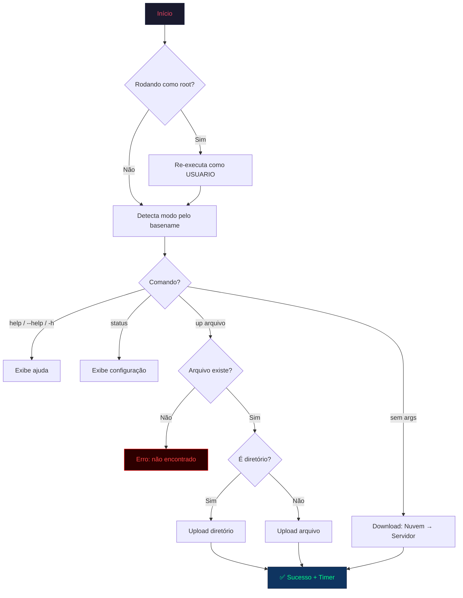

# 🚀 gdrive-rclone


Script unificado para sincronização de arquivos entre um servidor Linux e o Google Drive usando **rclone**. Suporta múltiplos modos de operação (diretórios diferentes) através de um único arquivo com symlinks.

---

## 📋 Índice

- [Funcionalidades](#-funcionalidades)
- [Pré-requisitos](#-pré-requisitos)
- [Instalação](#-instalação)
- [Configurando o rclone](#-configurando-o-rclone)
- [Google Drive API — Client ID próprio](#-google-drive-api--client-id-próprio)
- [Configuração do Script](#-configuração-do-script)
- [Uso](#-uso)
- [Modos de Operação](#-modos-de-operação)
- [Fluxo de Execução](#-fluxo-de-execução)
- [Parâmetros do rclone](#-parâmetros-do-rclone)
- [Exemplos](#-exemplos)
- [Troubleshooting](#-troubleshooting)
- [Desinstalação](#-desinstalação)

---

## ✨ Funcionalidades

- **Upload & Download** — Enviar e baixar arquivos/pastas do Google Drive
- **Modos múltiplos** — Um único script com symlinks para diferentes diretórios
- **Interface visual** — Banner ASCII art com gradiente de cores, painéis Unicode box-drawing
- **Timer de execução** — Mostra duração total da transferência ao final
- **Documentação inline** — Cada flag e seção do script está documentada
- **Auto-detecção de modo** — Baseado no nome do executável (`basename $0`)
- **Proteção root** — Re-executa automaticamente como usuário correto se rodado como root

---

## 📦 Pré-requisitos

- **Linux** com Bash 4.0+
- **rclone** instalado e configurado com um remoto Google Drive

### Instalar o rclone

```bash
curl https://rclone.org/install.sh | sudo bash
```

---

## 🔧 Instalação

```bash
# 1. Clone o repositório
git clone https://github.com/fullerhkz/gdrive-rclone.git

# 2. Copie o script para um diretório no PATH
sudo cp gdrive-rclone/gdrive /usr/local/bin/gdrive

# 3. Dê permissão de execução
sudo chmod +x /usr/local/bin/gdrive

# 4. Crie symlinks para os modos adicionais (exemplo)
sudo ln -s /usr/local/bin/gdrive /usr/local/bin/gdrive-filmes
sudo ln -s /usr/local/bin/gdrive /usr/local/bin/gdrive-backup
```

---

## 🔗 Configurando o rclone

O rclone armazena suas configurações (remotos, tokens, credenciais) no arquivo `rclone.conf`. Siga os passos abaixo para configurá-lo:

### 1. Crie o diretório de configuração

```bash
mkdir -p ~/.config/rclone/
```

### 2. Configure um remoto Google Drive

Se você está configurando o rclone pela primeira vez, execute o assistente interativo:

```bash
rclone config
```

Isso criará automaticamente o arquivo `~/.config/rclone/rclone.conf` com as credenciais do remoto.

### 3. Ou copie um `rclone.conf` existente

Se você já possui um `rclone.conf` configurado (ex: de outra máquina), basta copiá-lo para o diretório:

```bash
cp /caminho/do/seu/rclone.conf ~/.config/rclone/rclone.conf
```

### 4. Verifique a configuração

```bash
# Lista os remotos configurados
rclone listremotes

# Testa a conexão com o remoto
rclone lsd SEU_REMOTO:
```

> [!NOTE]
> O caminho padrão do `rclone.conf` é `~/.config/rclone/rclone.conf`. Você pode verificar o caminho usado com `rclone config file`.

---

## 🔑 Google Drive API — Client ID próprio

Por padrão, o rclone usa um **Client ID compartilhado** da Google Drive API para autenticação. Como esse Client ID é usado por todos os usuários do rclone ao redor do mundo, o Google impõe **limites de taxa (rate limits)** que podem causar:

- Transferências lentas
- Erros `403 Rate Limit Exceeded` ou `429 Too Many Requests`
- Throttling nas velocidades de upload/download

### Como resolver: criar seu próprio Client ID

Ao criar seu próprio **OAuth Client ID** no **Google Cloud Console**, você recebe uma cota dedicada exclusivamente para sua conta, o que resulta em:

- ✅ **Maior velocidade** de transferência
- ✅ **Sem compartilhamento** de limites com outros usuários
- ✅ **Menos erros** de rate limiting
- ✅ **Cota própria** da Google Drive API (padrão: 20.000 queries/100s por projeto)

> [!IMPORTANT]
> A documentação oficial do rclone **recomenda fortemente** que todos os usuários criem seu próprio Client ID. O processo é gratuito e leva poucos minutos.

### Passo a passo

Siga o guia oficial do rclone para criar seu Client ID e Client Secret:

🔗 **[rclone — Making your own client_id](https://rclone.org/drive/#making-your-own-client-id)**

Resumo dos passos:

1. Acesse o [Google Cloud Console](https://console.cloud.google.com/)
2. Crie (ou selecione) um **Projeto**
3. Ative a **Google Drive API** no projeto
4. Crie credenciais do tipo **OAuth 2.0 Client ID** (tipo: Desktop App)
5. Copie o `client_id` e `client_secret` gerados
6. Use-os ao configurar o remoto no rclone:

```bash
rclone config
# Quando solicitado, informe seu client_id e client_secret
```

> [!TIP]
> Após configurar com seu próprio Client ID, as flags de alta performance deste script (`--transfers=16`, `--drive-chunk-size=128M`) poderão operar na capacidade máxima sem sofrer throttling.

---

## ⚙️ Configuração do Script

> [!CAUTION]
> Antes de usar, você **DEVE** editar as variáveis no início do script com seus valores reais. O script não funcionará com os placeholders padrão.

### Passo 1 — Abra o script no editor de texto

```bash
nano /usr/local/bin/gdrive
```

> [!TIP]
> Você pode usar qualquer editor: `nano`, `vim`, `vi`, etc. O `nano` é o mais simples para iniciantes.

### Passo 2 — Altere o usuário do sistema

Localize a linha com `USUARIO` (próxima ao início do arquivo) e substitua pelo seu usuário Linux:

No script você encontrará:
```bash
USUARIO="SEU_USUARIO"
```

Altere para o seu usuário, por exemplo:
```bash
USUARIO="john"
```

> [!NOTE]
> Para descobrir seu usuário, execute `whoami` no terminal.

### Passo 3 — Configure os diretórios locais

O script suporta até 3 diretórios, cada um ativado por um comando/symlink diferente:

**Diretório 1** — modo padrão (comando: `gdrive`):
No script você encontrará:
```bash
DIRETORIO_1="/home/SEU_USUARIO/SEU_DIRETORIO_1"
```

Altere para o caminho real, por exemplo:
```bash
DIRETORIO_1="/home/john/downloads/geral"
```

**Diretório 2** — modo alternativo (ex: Filmes):
No script você encontrará:
```bash
DIRETORIO_2="/home/SEU_USUARIO/SEU_DIRETORIO_2"
MODO_2_SUFIXO="MODO_2"       # O que vem depois do traço no comando (gdrive-XXXX)
MODO_2_LABEL="MODO 2"        # Nome que aparece no painel
```

Exemplo: para criar o comando `gdrive-filme`:
```bash
DIRETORIO_2="/home/john/downloads/filmes"
MODO_2_SUFIXO="filmes"
MODO_2_LABEL="FILMES"
```
Depois crie o link:
```bash
sudo ln -s /usr/local/bin/gdrive /usr/local/bin/gdrive-filme
```

**Diretório 3** — modo alternativo (ex: Músicas):
No script você encontrará:
```bash
DIRETORIO_3="/home/SEU_USUARIO/SEU_DIRETORIO_3"
MODO_3_SUFIXO="MODO_3"
MODO_3_LABEL="MODO 3"
```

Exemplo: para criar o comando `gdrive-musicas`:
```bash
DIRETORIO_3="/home/john/downloads/musicas"
MODO_3_SUFIXO="musicas"
MODO_3_LABEL="MUSICAS"
```
Depois crie o link:
```bash
sudo ln -s /usr/local/bin/gdrive /usr/local/bin/gdrive-musicas
```

> [!TIP]
> Os campos `MODO_X_ICONE` e `MODO_X_COR` são opcionais — personalizam o ícone e a cor exibidos na interface do terminal.

### Passo 4 — Configure o remoto do rclone

Localize a linha `REMOTE_PATH` e substitua pelo nome do seu remoto e a pasta no Google Drive:

No script você encontrará:
```bash
REMOTE_PATH="SEU_REMOTO:/SEU_DIRETORIO_REMOTO"   # Caminho do remoto configurado no rclone
```

Altere para o seu remoto e pasta, por exemplo:
```bash
REMOTE_PATH="meugdrive:/Backups Servidor"         # Caminho do remoto configurado no rclone
```

> [!IMPORTANT]
> O nome antes dos `:` deve ser **exatamente** o nome do remoto configurado no rclone. Para verificar, execute:
> ```bash
> rclone listremotes
> ```
> Se o resultado for `meugdrive:`, então use `meugdrive:/Nome da Pasta`.

### Passo 5 — (Opcional) Altere o label do servidor

O label é apenas um texto exibido na interface durante as transferências. Personalize se quiser:

No script você encontrará:
```bash
LABEL_SERVIDOR="Servidor"                         # Label exibido na interface para o local
```

Altere se quiser, por exemplo:
```bash
LABEL_SERVIDOR="Servidor (Home)"                   # Label exibido na interface para o local
```

### Passo 6 — Salve e feche o editor

No `nano`, pressione:
1. **`Ctrl + O`** → salvar
2. **`Enter`** → confirmar o nome do arquivo
3. **`Ctrl + X`** → sair

### Resumo das variáveis

| Variável | Placeholder | Exemplo |
|----------|-------------|---------|
| `USUARIO` | `SEU_USUARIO` | `john` |
| `DIRETORIO_LOCAL` (normal) | `SEU_DIRETORIO_DOWNLOADS` | `/home/john/downloads/geral` |
| `DIRETORIO_LOCAL` (modos) | (outros caminhos) | `/home/john/downloads/filmes`, `/home/john/downloads/musicas` |
| `MODO_X_SUFIXO` | `MODO_X` | `filme` (para o comando `gdrive-filme`) |
| `REMOTE_PATH` | `SEU_REMOTO:/SEU_DIRETORIO_REMOTO` | `meugdrive:/Backups Servidor` |
| `LABEL_SERVIDOR` | `Servidor` | `Servidor (Home)` |

### Verificar a configuração

Após salvar, execute o comando abaixo para confirmar que tudo está configurado corretamente:

```bash
gdrive status
```

Isso exibirá um painel com o modo ativo, diretórios e parâmetros do rclone.

---

## 🚀 Uso

```bash
# Download: Nuvem → Servidor
gdrive

# Upload: Servidor → Nuvem (arquivo ou pasta)
gdrive up "Nome do Arquivo.mkv"
gdrive up "Nome da Pasta"

# Exibir ajuda
gdrive help

# Exibir configuração ativa
gdrive status
```

---

## 🎯 Modos de Operação

O script detecta o modo automaticamente pelo nome do executável (`basename $0`):

| Comando | Modo | Ícone | Diretório |
|---------|------|-------|-----------|
| `gdrive` | NORMAL | 📀 | Diretório padrão (`.../downloads/geral`) |
| `gdrive-filme` | FILMES | 🎬 | Diretório de filmes (`.../downloads/filmes`) |
| `gdrive-musicas` | MUSICAS | 🎵 | Diretório de músicas (`.../downloads/musicas`) |

Os modos adicionais são ativados via **symlinks** que apontam para o mesmo script `gdrive`. O nome do comando define qual configuração usar.

---

## 📋 Índice

- [Funcionalidades](#-funcionalidades)
- [Pré-requisitos](#-pré-requisitos)
- [Instalação](#-instalação)
- [Configurando o rclone](#-configurando-o-rclone)
- [Google Drive API — Client ID próprio](#-google-drive-api--client-id-próprio)
- [Configuração do Script](#-configuração-do-script)
- [Uso](#-uso)
- [Modos de Operação](#-modos-de-operação)
- [Fluxo de Execução](#-fluxo-de-execução)
- [Parâmetros do rclone](#-parâmetros-do-rclone)
- [Exemplos](#-exemplos)
- [Troubleshooting](#-troubleshooting)
- [Desinstalação](#-desinstalação)

---

## ✨ Funcionalidades

- **Upload & Download** — Enviar e baixar arquivos/pastas do Google Drive
- **Modos múltiplos** — Um único script com symlinks para diferentes diretórios
- **Interface visual** — Banner ASCII art com gradiente de cores, painéis Unicode box-drawing
- **Timer de execução** — Mostra duração total da transferência ao final
- **Documentação inline** — Cada flag e seção do script está documentada
- **Auto-detecção de modo** — Baseado no nome do executável (`basename $0`)
- **Proteção root** — Re-executa automaticamente como usuário correto se rodado como root

---

## 📦 Pré-requisitos

- **Linux** com Bash 4.0+
- **rclone** instalado e configurado com um remoto Google Drive

### Instalar o rclone

```bash
curl https://rclone.org/install.sh | sudo bash
```

---

## 🔧 Instalação

```bash
# 1. Clone o repositório
git clone https://github.com/fullerhkz/gdrive-rclone.git

# 2. Copie o script para um diretório no PATH
sudo cp gdrive-rclone/gdrive /usr/local/bin/gdrive

# 3. Dê permissão de execução
sudo chmod +x /usr/local/bin/gdrive

# 4. Crie symlinks para os modos adicionais (exemplo)
sudo ln -s /usr/local/bin/gdrive /usr/local/bin/gdrive-filmes
sudo ln -s /usr/local/bin/gdrive /usr/local/bin/gdrive-backup
```

---

## 🔗 Configurando o rclone

O rclone armazena suas configurações (remotos, tokens, credenciais) no arquivo `rclone.conf`. Siga os passos abaixo para configurá-lo:

### 1. Crie o diretório de configuração

```bash
mkdir -p ~/.config/rclone/
```

### 2. Configure um remoto Google Drive

Se você está configurando o rclone pela primeira vez, execute o assistente interativo:

```bash
rclone config
```

Isso criará automaticamente o arquivo `~/.config/rclone/rclone.conf` com as credenciais do remoto.

### 3. Ou copie um `rclone.conf` existente

Se você já possui um `rclone.conf` configurado (ex: de outra máquina), basta copiá-lo para o diretório:

```bash
cp /caminho/do/seu/rclone.conf ~/.config/rclone/rclone.conf
```

### 4. Verifique a configuração

```bash
# Lista os remotos configurados
rclone listremotes

# Testa a conexão com o remoto
rclone lsd SEU_REMOTO:
```

> [!NOTE]
> O caminho padrão do `rclone.conf` é `~/.config/rclone/rclone.conf`. Você pode verificar o caminho usado com `rclone config file`.

---

## 🔑 Google Drive API — Client ID próprio

Por padrão, o rclone usa um **Client ID compartilhado** da Google Drive API para autenticação. Como esse Client ID é usado por todos os usuários do rclone ao redor do mundo, o Google impõe **limites de taxa (rate limits)** que podem causar:

- Transferências lentas
- Erros `403 Rate Limit Exceeded` ou `429 Too Many Requests`
- Throttling nas velocidades de upload/download

### Como resolver: criar seu próprio Client ID

Ao criar seu próprio **OAuth Client ID** no **Google Cloud Console**, você recebe uma cota dedicada exclusivamente para sua conta, o que resulta em:

- ✅ **Maior velocidade** de transferência
- ✅ **Sem compartilhamento** de limites com outros usuários
- ✅ **Menos erros** de rate limiting
- ✅ **Cota própria** da Google Drive API (padrão: 20.000 queries/100s por projeto)

> [!IMPORTANT]
> A documentação oficial do rclone **recomenda fortemente** que todos os usuários criem seu próprio Client ID. O processo é gratuito e leva poucos minutos.

### Passo a passo

Siga o guia oficial do rclone para criar seu Client ID e Client Secret:

🔗 **[rclone — Making your own client_id](https://rclone.org/drive/#making-your-own-client-id)**

Resumo dos passos:

1. Acesse o [Google Cloud Console](https://console.cloud.google.com/)
2. Crie (ou selecione) um **Projeto**
3. Ative a **Google Drive API** no projeto
4. Crie credenciais do tipo **OAuth 2.0 Client ID** (tipo: Desktop App)
5. Copie o `client_id` e `client_secret` gerados
6. Use-os ao configurar o remoto no rclone:

```bash
rclone config
# Quando solicitado, informe seu client_id e client_secret
```

> [!TIP]
> Após configurar com seu próprio Client ID, as flags de alta performance deste script (`--transfers=16`, `--drive-chunk-size=128M`) poderão operar na capacidade máxima sem sofrer throttling.

---

## ⚙️ Configuração do Script

> [!CAUTION]
> Antes de usar, você **DEVE** editar as variáveis no início do script com seus valores reais. O script não funcionará com os placeholders padrão.

### Passo 1 — Abra o script no editor de texto

```bash
nano /usr/local/bin/gdrive
```

> [!TIP]
> Você pode usar qualquer editor: `nano`, `vim`, `vi`, etc. O `nano` é o mais simples para iniciantes.

### Passo 2 — Altere o usuário do sistema

Localize a linha com `USUARIO` (próxima ao início do arquivo) e substitua pelo seu usuário Linux:

No script você encontrará:
```bash
USUARIO="SEU_USUARIO"
```

Altere para o seu usuário, por exemplo:
```bash
USUARIO="john"
```

> [!NOTE]
> Para descobrir seu usuário, execute `whoami` no terminal.

### Passo 3 — Configure os diretórios locais

O script suporta até 3 diretórios, cada um ativado por um comando/symlink diferente:

**Diretório 1** — modo padrão (comando: `gdrive`):
No script você encontrará:
```bash
DIRETORIO_1="/home/SEU_USUARIO/SEU_DIRETORIO_1"
```

Altere para o caminho real, por exemplo:
```bash
DIRETORIO_1="/home/john/downloads/geral"
```

**Diretório 2** — modo alternativo (ex: Filmes):
No script você encontrará:
```bash
DIRETORIO_2="/home/SEU_USUARIO/SEU_DIRETORIO_2"
MODO_2_SUFIXO="MODO_2"       # O que vem depois do traço no comando (gdrive-XXXX)
MODO_2_LABEL="MODO 2"        # Nome que aparece no painel
```

Exemplo: para criar o comando `gdrive-filme`:
```bash
DIRETORIO_2="/home/john/downloads/filmes"
MODO_2_SUFIXO="filme"
MODO_2_LABEL="FILMES"
```
Depois crie o link:
```bash
sudo ln -s /usr/local/bin/gdrive /usr/local/bin/gdrive-filme
```

**Diretório 3** — modo alternativo (ex: Músicas):
No script você encontrará:
```bash
DIRETORIO_3="/home/SEU_USUARIO/SEU_DIRETORIO_3"
MODO_3_SUFIXO="MODO_3"
MODO_3_LABEL="MODO 3"
```

Exemplo: para criar o comando `gdrive-musicas`:
```bash
DIRETORIO_3="/home/john/downloads/musicas"
MODO_3_SUFIXO="musicas"
MODO_3_LABEL="MUSICAS"
```
Depois crie o link:
```bash
sudo ln -s /usr/local/bin/gdrive /usr/local/bin/gdrive-musicas
```

> [!TIP]
> Os campos `MODO_X_ICONE` e `MODO_X_COR` são opcionais — personalizam o ícone e a cor exibidos na interface do terminal.

### Passo 4 — Configure o remoto do rclone

Localize a linha `REMOTE_PATH` e substitua pelo nome do seu remoto e a pasta no Google Drive:

No script você encontrará:
```bash
REMOTE_PATH="SEU_REMOTO:/SEU_DIRETORIO_REMOTO"   # Caminho do remoto configurado no rclone
```

Altere para o seu remoto e pasta, por exemplo:
```bash
REMOTE_PATH="meugdrive:/Backups Servidor"         # Caminho do remoto configurado no rclone
```

> [!IMPORTANT]
> O nome antes dos `:` deve ser **exatamente** o nome do remoto configurado no rclone. Para verificar, execute:
> ```bash
> rclone listremotes
> ```
> Se o resultado for `meugdrive:`, então use `meugdrive:/Nome da Pasta`.

### Passo 5 — (Opcional) Altere o label do servidor

O label é apenas um texto exibido na interface durante as transferências. Personalize se quiser:

No script você encontrará:
```bash
LABEL_SERVIDOR="Servidor"                         # Label exibido na interface para o local
```

Altere se quiser, por exemplo:
```bash
LABEL_SERVIDOR="Servidor (Home)"                   # Label exibido na interface para o local
```

### Passo 6 — Salve e feche o editor

No `nano`, pressione:
1. **`Ctrl + O`** → salvar
2. **`Enter`** → confirmar o nome do arquivo
3. **`Ctrl + X`** → sair

### Resumo das variáveis

| Variável | Placeholder | Exemplo |
|----------|-------------|---------|
| `USUARIO` | `SEU_USUARIO` | `john` |
| `DIRETORIO_LOCAL` (normal) | `SEU_DIRETORIO_DOWNLOADS` | `/home/john/downloads/geral` |
| `DIRETORIO_LOCAL` (modos) | (outros caminhos) | `/home/john/downloads/filmes`, `/home/john/downloads/musicas` |
| `MODO_X_SUFIXO` | `MODO_X` | `filme` (para o comando `gdrive-filme`) |
| `REMOTE_PATH` | `SEU_REMOTO:/SEU_DIRETORIO_REMOTO` | `meugdrive:/Backups Servidor` |
| `LABEL_SERVIDOR` | `Servidor` | `Servidor (Home)` |

### Verificar a configuração

Após salvar, execute o comando abaixo para confirmar que tudo está configurado corretamente:

```bash
gdrive status
```

Isso exibirá um painel com o modo ativo, diretórios e parâmetros do rclone.

---

## 🚀 Uso

```bash
# Download: Nuvem → Servidor
gdrive

# Upload: Servidor → Nuvem (arquivo ou pasta)
gdrive up "Nome do Arquivo.mkv"
gdrive up "Nome da Pasta"

# Exibir ajuda
gdrive help

# Exibir configuração ativa
gdrive status
```

---

## 🎯 Modos de Operação

O script detecta o modo automaticamente pelo nome do executável (`basename $0`):

| Comando | Modo | Ícone | Diretório |
|---------|------|-------|-----------|
| `gdrive` | NORMAL | 📀 | Diretório padrão (`.../downloads/geral`) |
| `gdrive-filme` | FILMES | 🎬 | Diretório de filmes (`.../downloads/filmes`) |
| `gdrive-musicas` | MUSICAS | 🎵 | Diretório de músicas (`.../downloads/musicas`) |

| Comando | Modo | Ícone | Diretório |
|---------|------|-------|-----------|
| `gdrive` | NORMAL | 📀 | Diretório padrão de downloads |
| `gdrive-filmes` | FILMES | 🎬 | Diretório de filmes (exemplo) |
| `gdrive-backup` | BACKUP | �️ | Diretório de backups (exemplo) |

Os modos adicionais são ativados via **symlinks** que apontam para o mesmo script `gdrive`. O nome do comando define qual configuração usar.

---

## 🔄 Fluxo de Execução



---

## ⚡ Parâmetros do rclone

Cada flag usada está documentada abaixo. Apenas flags que melhoram a velocidade foram alteradas em relação ao padrão.

| Flag | Valor | Descrição |
|------|-------|-----------|
| `-P` | — | Exibe progresso em tempo real |
| `--ignore-checksum` | — | Pula verificação de checksum (confia no tamanho) |
| `--transfers` | `16` | Transferências simultâneas de arquivos |
| `--checkers` | `32` | Verificadores paralelos (compara origem/destino) |
| `--buffer-size` | `64M` | Buffer em memória por transferência |
| `--drive-chunk-size` | `128M` | Tamanho de cada chunk HTTP (mais = mais rápido) |
| `--drive-upload-cutoff` | `64M` | Limiar para upload resumable (chunks) |
| `--retries` | `3` | Tentativas em caso de falha |
| `--multi-thread-streams` | `16` | Threads para download de arquivos grandes |
| `--fast-list` | — | LIST recursivo único (menos requests, mais RAM) |
| `--drive-acknowledge-abuse` | — | Permite baixar arquivos com abuse flag |

> [!WARNING]
> `--drive-chunk-size=128M` × `--transfers=16` = até **~2GB de RAM** durante uploads. Ajuste esses valores se o servidor tiver pouca memória.

---

## 📝 Exemplos

```bash
# Sincronizar tudo da nuvem para o servidor (modo normal)
$ gdrive

# Enviar um filme para a nuvem
$ gdrive up "Filme.2024.1080p.BluRay.mkv"

# Enviar uma pasta inteira
$ gdrive up "Serie Completa S01"

# Upload no modo alternativo (ex: Filmes)
$ gdrive-filme up "Filme_Legal_2024.mkv"

# Upload no modo alternativo (ex: Músicas)
$ gdrive-musicas up "Album Completo.zip"

# Ver configuração atual
$ gdrive status
```

### Saída Esperada (upload)

```
  ╔═══════════════════════════════════════════════════════════╗
  ║                                                           ║
  ║   ███████╗██╗   ██╗██╗     ██╗     ███████╗██████╗        ║
  ║   ██╔════╝██║   ██║██║     ██║     ██╔════╝██╔══██╗       ║
  ║   █████╗  ██║   ██║██║     ██║     █████╗  ██████╔╝       ║
  ║   ██╔══╝  ██║   ██║██║     ██║     ██╔══╝  ██╔══██╗       ║
  ║   ██║     ╚██████╔╝███████╗███████╗███████╗██║  ██║       ║
  ║   ╚═╝      ╚═════╝ ╚══════╝╚══════╝╚══════╝╚═╝  ╚═╝       ║
  ║                                                           ║
  ║          S Y N C   M A N A G E R  v2.0                    ║
  ╚═══════════════════════════════════════════════════════════╝

  13/02/2026 20:55:00  │  Usuário: user  │  Modo: NORMAL 📀
  ───────────────────────────────────────────────────────────

  ┌─ Operação ──────────────────────────────────────────────
  │  ▶ UPLOAD ⬆  (Arquivo)
  │
  │  Origem :  📄 Servidor  →  Filme.2024.mkv
  │  Destino:  ☁️  Google Drive
  │
  │  ⟫ Enviando arquivo para a nuvem...
  └──────────────────────────────────────────────────────────

  ═══════════════════════════════════════════════════════════
  ✅ Transferência concluída com sucesso!
  ⏱  Duração total: 2m 34s
  ═══════════════════════════════════════════════════════════
```

---

## 🔍 Troubleshooting

| Problema | Causa | Solução |
|----------|-------|---------|
| `rclone: command not found` | rclone não instalado | `curl https://rclone.org/install.sh \| sudo bash` |
| `Arquivo ou diretório não encontrado` | Caminho incorreto ou arquivo não existe | Verifique o nome exato do arquivo/pasta |
| `Failed to create file system` | Remoto não configurado no rclone | Execute `rclone config` e configure o remoto |
| Sem cores no terminal | Terminal não suporta ANSI 256-color | Use um terminal moderno (ex: `xterm-256color`) |
| Erro de permissão | Script executado sem `chmod +x` | `chmod +x /usr/local/bin/gdrive` |
| Upload lento | Chunk size muito pequeno ou instabilidade | Verifique `gdrive status` e ajuste `--drive-chunk-size` |
| `403 Rate Limit Exceeded` | Usando o Client ID compartilhado do rclone | Crie seu próprio Client ID — veja [Google Drive API](#-google-drive-api--client-id-próprio) |
| Muita RAM usada | 128M × 16 transfers = ~2GB | Reduza `--transfers` ou `--drive-chunk-size` |

---

## 🗑️ Desinstalação

```bash
# Remover script e symlinks
# Remover script e symlinks
sudo rm /usr/local/bin/gdrive
sudo rm /usr/local/bin/gdrive-filme
sudo rm /usr/local/bin/gdrive-musicas

# Remover repositório local (opcional)
rm -rf ~/gdrive-rclone
```

---

## 📄 Licença

Este projeto é distribuído sob a licença MIT. Veja o arquivo [LICENSE](LICENSE) para mais detalhes.
