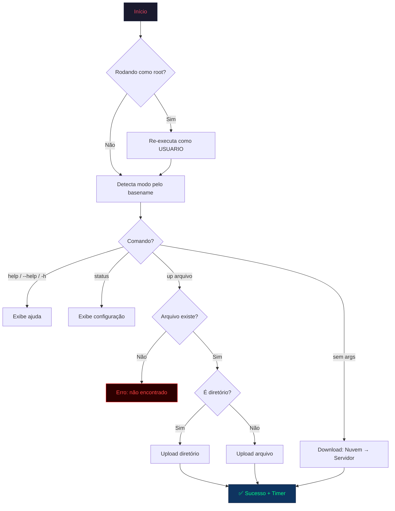

# 🚀 gdrive-rclone


Script unificado para sincronização de arquivos entre um servidor Linux e o Google Drive usando **rclone**. Suporta múltiplos modos de operação (diretórios diferentes) através de um único arquivo com symlinks.

---

## 📋 Índice

- [Funcionalidades](#-funcionalidades)
- [Pré-requisitos](#-pré-requisitos)
- [Instalação](#-instalação)
- [Configuração](#-configuração)
- [Uso](#-uso)
- [Modos de Operação](#-modos-de-operação)
- [Fluxo de Execução](#-fluxo-de-execução)
- [Parâmetros do rclone](#-parâmetros-do-rclone)
- [Exemplos](#-exemplos)
- [Troubleshooting](#-troubleshooting)
- [Desinstalação](#-desinstalação)

---

## ✨ Funcionalidades

- **Upload & Download** — Enviar e baixar arquivos/pastas do Google Drive
- **Modos múltiplos** — Um único script com symlinks para diferentes diretórios
- **Interface visual** — Banner ASCII art com gradiente de cores, painéis Unicode box-drawing
- **Timer de execução** — Mostra duração total da transferência ao final
- **Documentação inline** — Cada flag e seção do script está documentada
- **Auto-detecção de modo** — Baseado no nome do executável (`basename $0`)
- **Proteção root** — Re-executa automaticamente como usuário correto se rodado como root

---

## 📦 Pré-requisitos

- **Linux** com Bash 4.0+
- **rclone** instalado e configurado com um remoto Google Drive
  ```bash
  # Instalar rclone
  curl https://rclone.org/install.sh | sudo bash

  # Configurar remoto (siga o assistente interativo)
  rclone config
  ```

---

## 🔧 Instalação

```bash
# 1. Clone o repositório
git clone https://github.com/fullerhkz/gdrive-rclone.git

# 2. Copie o script para um diretório no PATH
sudo cp gdrive-rclone/gdrive /usr/local/bin/gdrive

# 3. Dê permissão de execução
sudo chmod +x /usr/local/bin/gdrive

# 4. Crie symlinks para os modos adicionais (opcional)
sudo ln -s /usr/local/bin/gdrive /usr/local/bin/gdrive-rip
sudo ln -s /usr/local/bin/gdrive /usr/local/bin/gdrive-perma
```

---

## ⚙️ Configuração

> [!CAUTION]
> Antes de usar, você **DEVE** editar as variáveis no início do script com seus valores reais. O script não funcionará com os placeholders padrão.

Abra o script e altere as seguintes variáveis:

| Variável | Placeholder | Descrição |
|----------|-------------|-----------|
| `USUARIO` | `SEU_USUARIO` | Usuário Linux que executará o script |
| `DIRETORIO_LOCAL` (normal) | `SEU_DIRETORIO_DOWNLOADS` | Diretório local para o modo NORMAL |
| `DIRETORIO_LOCAL` (rip) | `SEU_DIRETORIO_DOWNLOADS_RIP` | Diretório local para o modo RIP |
| `DIRETORIO_LOCAL` (perma) | `SEU_DIRETORIO_DOWNLOADS_PERMANENTE` | Diretório local para o modo PERMANENTE |
| `REMOTE_PATH` | `SEU_REMOTO:/SEU_DIRETORIO_REMOTO` | Nome do remoto rclone + pasta no Drive |
| `LABEL_SERVIDOR` | `Servidor` | Label exibido na interface para o local |

> [!IMPORTANT]
> O valor de `REMOTE_PATH` deve corresponder exatamente ao nome do remoto configurado no `rclone config`. Use `rclone listremotes` para verificar.

---

## 🚀 Uso

```bash
# Download: Nuvem → Servidor
gdrive

# Upload: Servidor → Nuvem (arquivo ou pasta)
gdrive up "Nome do Arquivo.mkv"
gdrive up "Nome da Pasta"

# Exibir ajuda
gdrive help

# Exibir configuração ativa
gdrive status
```

---

## 🎯 Modos de Operação

O script detecta o modo automaticamente pelo nome do executável (`basename $0`):

| Comando | Modo | Ícone | Diretório |
|---------|------|-------|-----------|
| `gdrive` | NORMAL | 📀 | Diretório padrão de downloads |
| `gdrive-rip` | RIP | 💀 | Diretório alternativo (rip) |
| `gdrive-perma` | PERMANENTE | 💎 | Diretório permanente |

Os modos RIP e PERMANENTE são ativados via **symlinks** que apontam para o mesmo script `gdrive`.

---

## 🔄 Fluxo de Execução



---

## ⚡ Parâmetros do rclone

Cada flag usada está documentada abaixo. Apenas flags que melhoram a velocidade foram alteradas em relação ao padrão.

| Flag | Valor | Descrição |
|------|-------|-----------|
| `-P` | — | Exibe progresso em tempo real |
| `--ignore-checksum` | — | Pula verificação de checksum (confia no tamanho) |
| `--transfers` | `16` | Transferências simultâneas de arquivos |
| `--checkers` | `32` | Verificadores paralelos (compara origem/destino) |
| `--buffer-size` | `64M` | Buffer em memória por transferência |
| `--drive-chunk-size` | `128M` | Tamanho de cada chunk HTTP (mais = mais rápido) |
| `--drive-upload-cutoff` | `64M` | Limiar para upload resumable (chunks) |
| `--retries` | `3` | Tentativas em caso de falha |
| `--multi-thread-streams` | `16` | Threads para download de arquivos grandes |
| `--fast-list` | — | LIST recursivo único (menos requests, mais RAM) |
| `--drive-acknowledge-abuse` | — | Permite baixar arquivos com abuse flag |

> [!WARNING]
> `--drive-chunk-size=128M` × `--transfers=16` = até **~2GB de RAM** durante uploads. Ajuste esses valores se o servidor tiver pouca memória.

---

## 📝 Exemplos

```bash
# Sincronizar tudo da nuvem para o servidor (modo normal)
$ gdrive

# Enviar um filme para a nuvem
$ gdrive up "Filme.2024.1080p.BluRay.mkv"

# Enviar uma pasta inteira
$ gdrive up "Serie Completa S01"

# Upload no modo permanente
$ gdrive-perma up "Discografia Completa"

# Ver configuração atual
$ gdrive status
```

### Saída Esperada (upload)

```
  ╔═══════════════════════════════════════════════════════════╗
  ║                                                           ║
  ║   ███████╗██╗   ██╗██╗     ██╗     ███████╗██████╗        ║
  ║   ██╔════╝██║   ██║██║     ██║     ██╔════╝██╔══██╗       ║
  ║   █████╗  ██║   ██║██║     ██║     █████╗  ██████╔╝       ║
  ║   ██╔══╝  ██║   ██║██║     ██║     ██╔══╝  ██╔══██╗       ║
  ║   ██║     ╚██████╔╝███████╗███████╗███████╗██║  ██║       ║
  ║   ╚═╝      ╚═════╝ ╚══════╝╚══════╝╚══════╝╚═╝  ╚═╝       ║
  ║                                                           ║
  ║          S Y N C   M A N A G E R  v2.0                    ║
  ╚═══════════════════════════════════════════════════════════╝

  13/02/2026 20:55:00  │  Usuário: user  │  Modo: NORMAL 📀
  ───────────────────────────────────────────────────────────

  ┌─ Operação ──────────────────────────────────────────────
  │  ▶ UPLOAD ⬆  (Arquivo)
  │
  │  Origem :  📄 Servidor  →  Filme.2024.mkv
  │  Destino:  ☁️  Google Drive
  │
  │  ⟫ Enviando arquivo para a nuvem...
  └──────────────────────────────────────────────────────────

  ═══════════════════════════════════════════════════════════
  ✅ Transferência concluída com sucesso!
  ⏱  Duração total: 2m 34s
  ═══════════════════════════════════════════════════════════
```

---

## 🔍 Troubleshooting

| Problema | Causa | Solução |
|----------|-------|---------|
| `rclone: command not found` | rclone não instalado | `curl https://rclone.org/install.sh \| sudo bash` |
| `Arquivo ou diretório não encontrado` | Caminho incorreto ou arquivo não existe | Verifique o nome exato do arquivo/pasta |
| `Failed to create file system` | Remoto não configurado no rclone | Execute `rclone config` e configure o remoto |
| Sem cores no terminal | Terminal não suporta ANSI 256-color | Use um terminal moderno (ex: `xterm-256color`) |
| Erro de permissão | Script executado sem `chmod +x` | `chmod +x /usr/local/bin/gdrive` |
| Upload lento | Chunk size muito pequeno ou instabilidade | Verifique `gdrive status` e ajuste `--drive-chunk-size` |
| Muita RAM usada | 128M × 16 transfers = ~2GB | Reduza `--transfers` ou `--drive-chunk-size` |

---

## 🗑️ Desinstalação

```bash
# Remover script e symlinks
sudo rm /usr/local/bin/gdrive
sudo rm /usr/local/bin/gdrive-rip
sudo rm /usr/local/bin/gdrive-perma

# Remover repositório local (opcional)
rm -rf ~/gdrive-rclone
```

---

## 📄 Licença

Este projeto é distribuído sob a licença MIT. Veja o arquivo [LICENSE](LICENSE) para mais detalhes.
